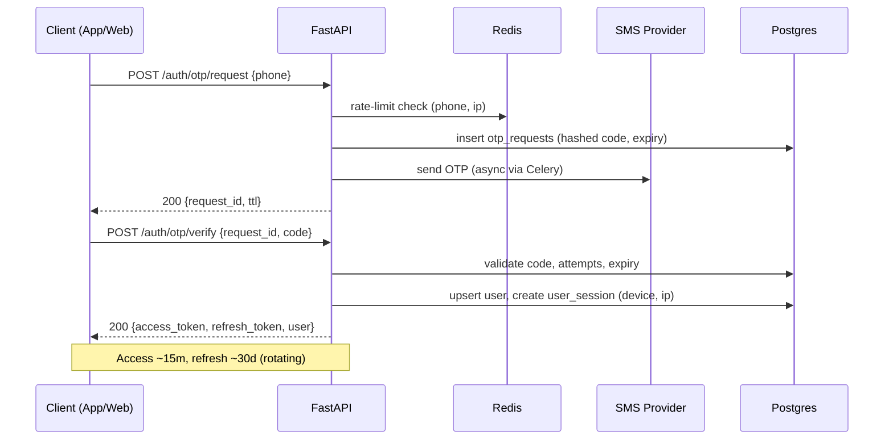
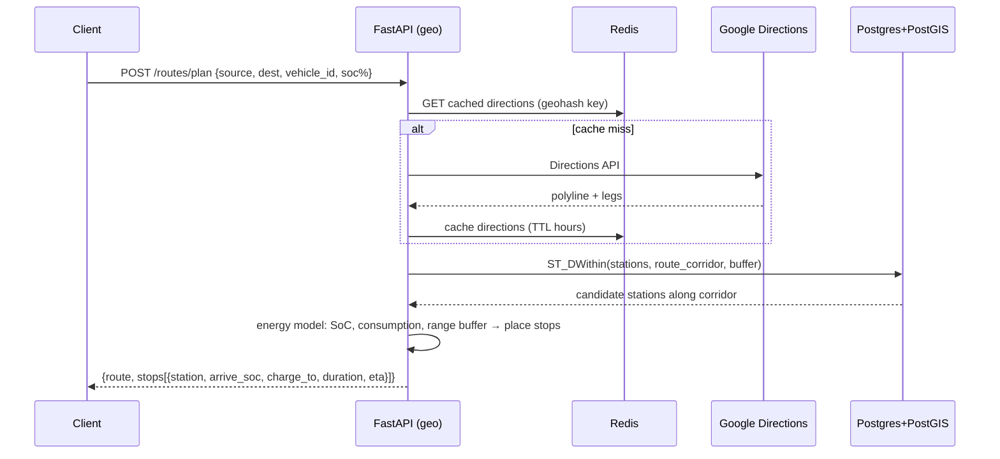
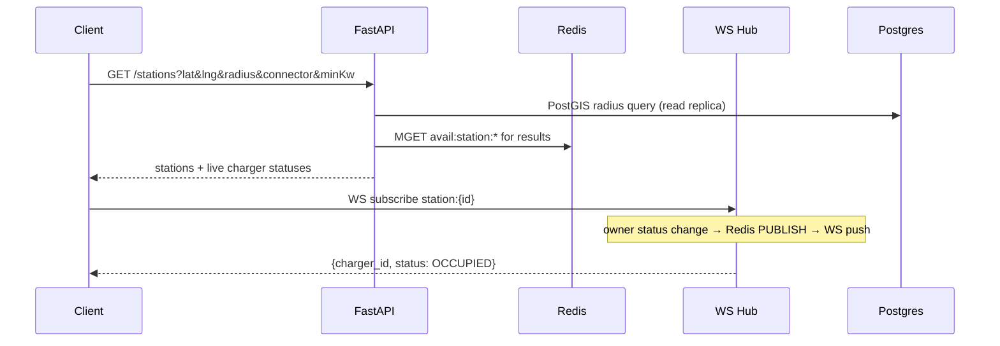

# 03 · User Flows

Sequence diagrams use Mermaid. Each flow lists pre-conditions, happy path, and key edge cases.

---

## 3.1 OTP Login & Session

**Pre:** none. **Post:** access + refresh tokens, device session recorded.



**Edge cases:** wrong code (increment attempts, lock after N), expired OTP, resend throttle, new-device → notify, blocked phone.

---

## 3.2 Route Planning → Charging Stops *(core differentiator)*

**Pre:** authenticated, ≥1 vehicle selected (for battery/connector). **Post:** route + recommended stops + booking candidates.



**Energy model (MVP heuristic):**
`usable_range = battery_kWh * efficiency / consumption_per_km`; place a stop before projected SoC < safety floor (e.g. 15%), choosing stations with matching connector + min power, minimizing detour + price.

**Edge cases:** no station in range (warn + widen buffer), connector mismatch filter empties list, Maps quota exhausted (serve cached/degraded), multi-stop optimization (greedy MVP → DP/AI in Phase 2).

---

## 3.3 Discovery & Real-Time Availability



---

## 3.4 Booking → Payment → Confirmation

**Pre:** authenticated, station + charger + slot chosen. **Post:** `CONFIRMED` booking + signed QR.

```mermaid
sequenceDiagram
  participant C as Client
  participant API as FastAPI (booking)
  participant R as Redis
  participant DB as Postgres
  participant RP as Razorpay
  participant W as Celery

  C->>API: POST /bookings {charger_id, slot_id, vehicle_id}
  API->>R: SET NX lock:slot:{charger}:{slot}
  API->>DB: verify slot free; insert booking PENDING_PAYMENT
  API->>RP: create order (amount, receipt=booking_id, idempotency)
  API-->>C: {booking_id, razorpay_order_id, key}
  C->>RP: checkout (card/UPI) → success
  RP-->>API: webhook payment.captured (HMAC signed)
  API->>API: verify signature + idempotency
  API->>DB: booking CONFIRMED; payment + transaction rows
  API->>API: issue signed QR (booking,station,user,exp,sig)
  API->>W: enqueue invoice + FCM "Booking confirmed"
  API-->>C: (poll / WS) booking CONFIRMED + qr_token
```

**Edge cases:** payment failed/abandoned → Beat releases slot at hold TTL, booking `EXPIRED`; duplicate webhook → idempotent no-op; partial capture; user cancels (refund policy windows); slot lost between lock-expiry and payment (refund + apology credit).

---

## 3.5 Arrival → QR Scan → Verify → Session Start/Complete

```mermaid
sequenceDiagram
  participant U as User App
  participant O as Owner App
  participant API as FastAPI (qr/sessions)
  participant DB as Postgres
  participant W as Celery

  U->>U: show QR (signed token)
  O->>API: POST /qr/verify {qr_token, station_id}
  API->>API: verify signature + expiry
  API->>DB: booking exists? payment ok? slot valid now? not used?
  API-->>O: 200 {valid, user, vehicle, charger, slot}
  O->>API: POST /sessions/start {booking_id}
  API->>DB: charging_sessions row; charger OCCUPIED; status_history
  Note over O: charging...
  O->>API: POST /sessions/{id}/complete {energy_kwh, end}
  API->>DB: session COMPLETED; charger AVAILABLE
  API->>W: invoice (energy*price+fees-discounts), rewards accrual, FCM
  API-->>O: 200 {summary}
```

**Edge cases:** QR expired/replayed (reject + audit), wrong station, early/late arrival vs slot (grace window), no-show (auto cancel + partial charge), meter dispute (admin adjustment + audit log).

---

## 3.6 Owner: Availability & Maintenance Control

```mermaid
sequenceDiagram
  participant O as Owner App
  participant API as FastAPI (availability)
  participant DB as Postgres
  participant R as Redis
  O->>API: PATCH /chargers/{id}/status {MAINTENANCE}
  API->>DB: append charger_status_history; update charger
  API->>R: update avail cache + PUBLISH station channel
  API-->>O: 200
  Note over API: existing future bookings on that charger → notify+rebook/refund (Celery)
```

---

## 3.7 Refund Flow (User-initiated / Admin)

```mermaid
sequenceDiagram
  participant C as Client/Admin
  participant API as FastAPI (payments)
  participant RP as Razorpay
  participant DB as Postgres
  C->>API: POST /bookings/{id}/cancel
  API->>API: apply refund policy (window → %)
  API->>RP: refund (amount, idempotency)
  RP-->>API: refund initiated
  API->>DB: booking CANCELLED; transaction REFUND_PENDING
  RP-->>API: webhook refund.processed
  API->>DB: transaction REFUNDED; reverse rewards
```

---

## 3.8 Station Owner Onboarding & Admin Approval

```mermaid
sequenceDiagram
  participant O as Owner
  participant API as FastAPI
  participant A as Admin
  participant DB as Postgres
  O->>API: POST /owner/stations (KYC, docs→S3, geo, chargers)
  API->>DB: station PENDING_APPROVAL
  A->>API: GET /admin/stations?status=PENDING
  A->>API: POST /admin/stations/{id}/approve
  API->>DB: station ACTIVE; chargers AVAILABLE
  API-->>O: FCM "Station approved"
```

**Edge:** rejection with reason, document re-submission, suspend station (fraud), bulk import.
