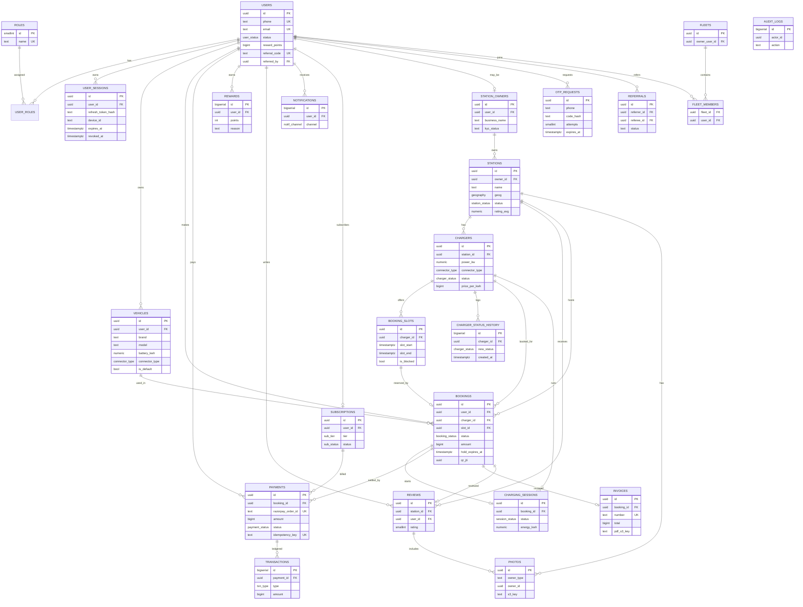

# 05 · ER Diagram

> Rendered with Mermaid. Cardinalities: `||--o{` = one-to-many, `||--||` = one-to-one, `}o--o{` = many-to-many.

## Relationship Notes

- A **user** may also be a **station owner** (1:0..1 via `station_owners.user_id`) and/or part of fleets.
- **Bookings** are the hub: linked to user, vehicle, station, charger, slot; spawn one optional **charging_session**, one optional **invoice**, many **payments** (retries/refunds), and one optional **review**.
- **booking_slots** ↔ **bookings** is 1:0..1 for *active* bookings (enforced by partial unique index), allowing slot reuse after cancellation/expiry.
- **transactions** form an append-only financial ledger under each payment.
- `AUDIT_LOGS` references actors loosely (no hard FK) so logs survive entity deletion.
