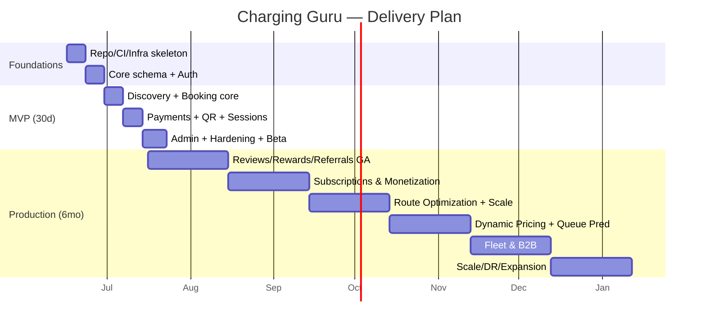

# 18 · Development Milestones

Consolidated milestone plan with timeline, exit criteria, ownership, and the path from documentation → code.

## 1. Milestone Timeline (Gantt)

## 2. Milestone Gates & Exit Criteria

| Gate | Date (approx) | Exit criteria |
|------|---------------|---------------|
| **M0 Foundations** | Day 14 | Login E2E on staging; CI green; seeded station via API; IaC staging up |
| **M1 Core** | Day 21 | Live availability; slot booking; double-booking impossible under load |
| **M2 Transact** | Day 28 | Full book→pay→QR→scan→session→invoice; refunds work |
| **M3 MVP/Beta** | Day 30 | Closed beta on NCR with real payments; monitoring+rollback proven; admin approvals/refunds |
| **M4 GA** | Month 1 | Public launch; reviews/rewards/referrals GA; >98% payment success |
| **M5 Revenue** | Month 2 | Subscriptions live; operator payouts; GST invoices |
| **M6 Differentiator** | Month 3 | AI route optimization GA; discovery p95<300ms at 5× load |
| **M7 Intelligence** | Month 4 | Dynamic pricing + queue prediction with guardrails |
| **M8 B2B** | Month 5 | Fleet management + consolidated billing live |
| **M9 Scale** | Month 6 | 50k bookings/day load test passes SLOs; DR drill passed; 2nd corridor |

## 3. Workstream Ownership (RACI-lite)

| Workstream | Lead | Supporting |
|-----------|------|-----------|
| Backend/API | Backend lead | full-stack |
| Data/DB/migrations | Backend lead | DevOps |
| Payments/QR/security | Backend + DevOps | PM |
| User app (RN) | Mobile lead | full-stack |
| Owner app (RN) | Mobile lead | — |
| User web + Admin | Web lead | full-stack |
| Infra/CI/CD/observability | DevOps/SRE | backend |
| Route/AI/pricing (Phase 2) | Data/ML | backend |
| Supply/BD (non-eng) | BD/Ops | PM |

## 4. Definition of Done (per feature)
- Code + tests (unit + integration/API) merged, CI green.
- OpenAPI updated; client types regenerated.
- Observability: metrics + logs + Sentry wired; dashboard/alert if user-facing.
- Security review for auth/payment/PII-touching changes; audit logging where privileged.
- Docs updated; feature-flagged rollout where risky.

## 5. Engineering Practices
- Trunk-based with short-lived PRs; required reviews; conventional commits.
- Expand/contract DB migrations (zero-downtime); migrations gated in CI/CD.
- Test pyramid: many unit (services/domain), focused integration (repos w/ testcontainers), few e2e (Playwright/Detox) + load (k6/Locust).
- Error budgets drive feature-vs-reliability prioritization.

## 6. From Documentation → Code (next steps)

This `docs/` set is complete and build-ready. Recommended scaffolding order:

1. **`backend/`** — app factory, `core/` (config, db, redis, security, errors, logging), `models/` + first Alembic migration (users/roles/sessions/vehicles/stations/chargers/slots/bookings), `api/v1/auth.py` + `services/auth_service.py`. Stand up docker-compose + `/health`.
2. **Auth vertical slice** end-to-end (OTP→JWT→refresh) with tests — proves the architecture.
3. **Discovery + booking vertical slice** (PostGIS query, availability cache/WS, booking lock).
4. **Payments + QR + sessions**.
5. **Clients**: typed API client from OpenAPI → user app/web discovery+booking → owner scan → admin approvals.
6. **CI/CD + IaC** in parallel from day one.

> Say the word and I'll scaffold the backend skeleton (FastAPI app factory, core layer, models, first migration, docker-compose, and the auth vertical slice with tests) as the first runnable increment.

## 7. Hiring/Resourcing Milestones
- Pre-MVP: 6 (2 BE, 1 web, 1 mobile, 0.5 DevOps, 1 PM/QA, 0.5 design).
- Month 2–3: +1 mobile, +1 web, +1 DevOps.
- Month 4+: +1 data/ML, +1 backend, +1 PM/QA as fleet/pricing land.
